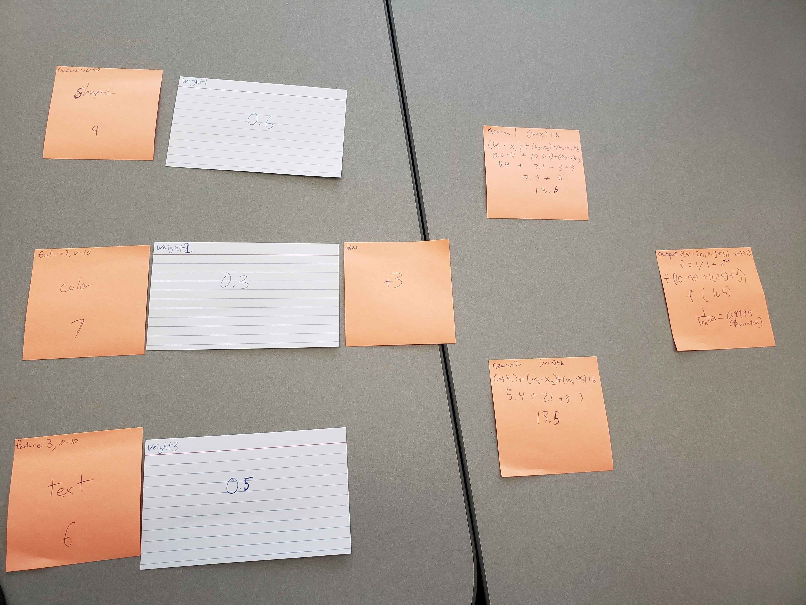

## Names: Mordred Boulais, Haylee Pierce

### Image

### Performance

Did the network's output make sense?
How could you adjust weights or activation functions to improve accuracy?
What did you notice about how small changes (e.g., weights) affect outcomes?

The network's output did make sense, as the values chosen would indicate that
the processed data was the desired outcome (an image of a U.S. stop sign).
Our activation functions were referenced off of examples of sigmoid functions,
as that is relatively simple. TODO: Another trial

### Ethics

What potential biases or ethical considerations could arise in your example scenario?

We chose our bias value based on the fact that we are primarily referencing U.S. stop
signs, as that was our primary bias consideration in the construction of our example.
Ethically speaking, our system is relatively contained and less likely to be liable for
larger ethical concerns, seeing as it would likely only be used as part of a larger system.

### Reflection

What was easy to understand about the neural network?
What challenges did you face?
